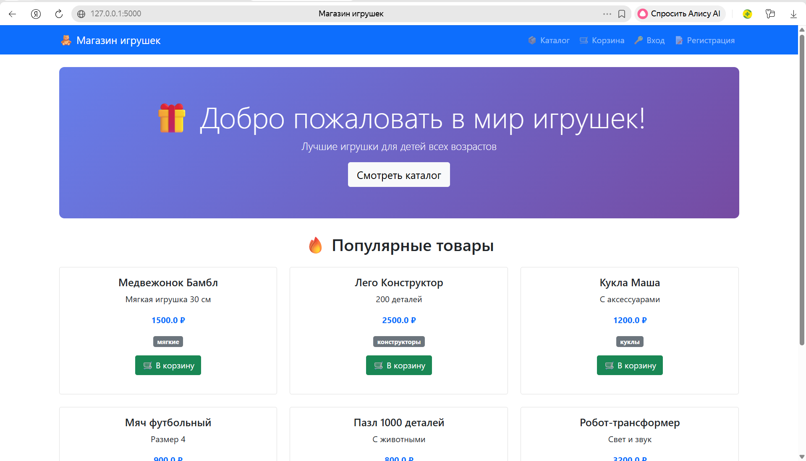
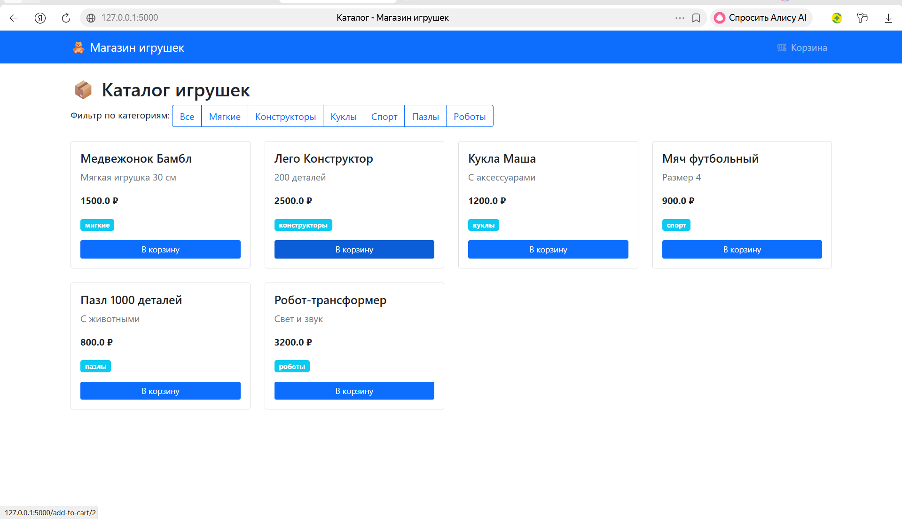
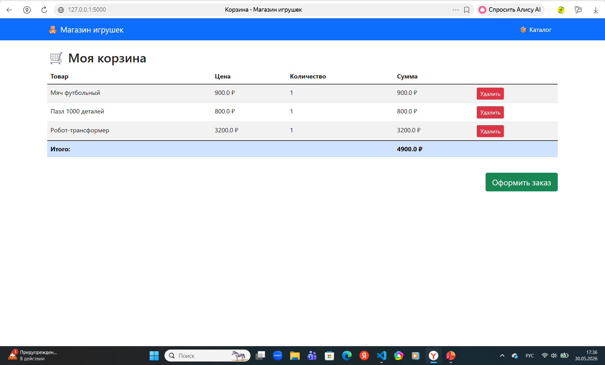
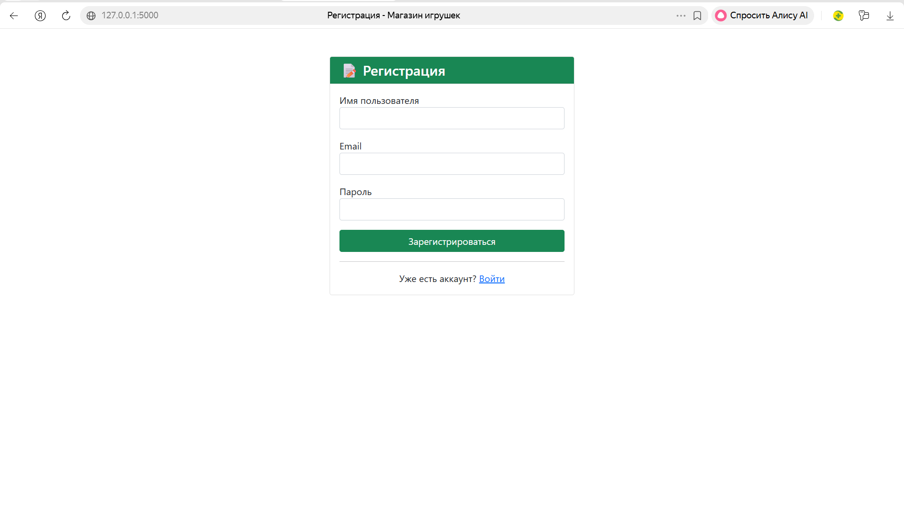
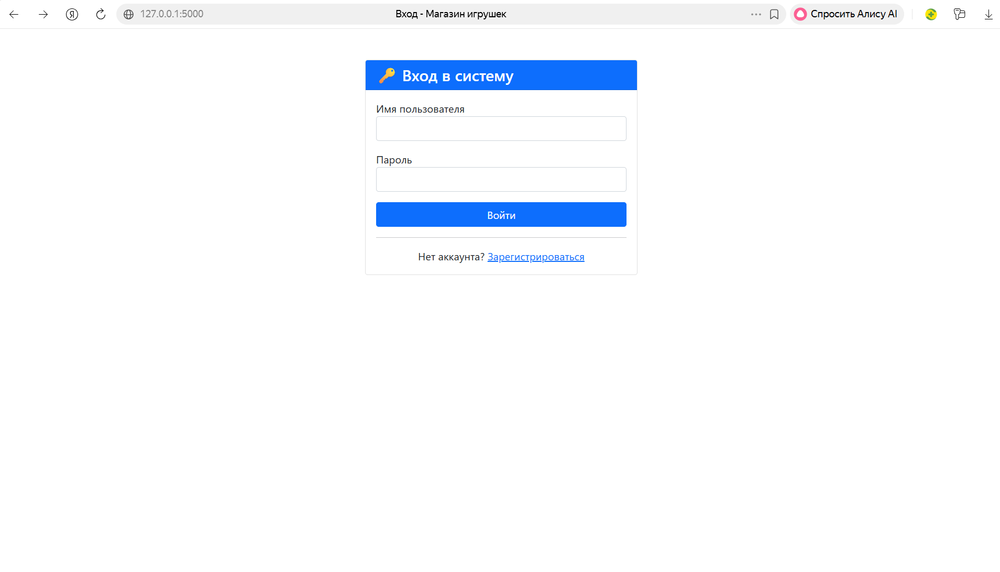

# 🧸 Интернет-магазин игрушек

[](https://www.python.org/)
[](https://flask.palletsprojects.com/)
[](https://www.sqlite.org/)
[](https://opensource.org/licenses/MIT)

Полнофункциональный интернет-магазин игрушек, созданный на Flask с использованием SQLite, Bootstrap 5 и аутентификацией пользователей.

## ✨ Возможности

- 📦 **Каталог товаров** с фильтрацией по категориям
- 🛒 **Корзина покупок** с возможностью изменения количества
- 👤 **Регистрация и авторизация** пользователей
- 💰 **Оформление заказов** для авторизованных пользователей
- 🎨 **Адаптивный дизайн** на Bootstrap 5
- 📱 **Полностью адаптивен** для мобильных устройств

## 🛍️ Товары в магазине

| Категория | Товары |
|-----------|--------|
| Мягкие игрушки | Медвежонок Бамбл |
| Конструкторы | Лего Конструктор |
| Куклы | Кукла Маша |
| Спорт | Мяч футбольный |
| Пазлы | Пазл 1000 деталей |
| Роботы | Робот-трансформер |

## 🚀 Установка и запуск

### 1. Клонируйте репозиторий
```bash
git clone https://github.com/Efremovvi/toy-store.git
cd toy-store
## 📸 Скриншоты

### Главная страница


### Каталог товаров


### Корзина покупок


### Регистрация


### Вход в систему
